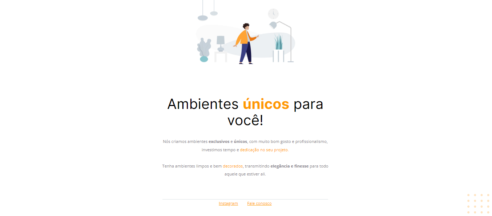

<h1 align="center"> Primeiro Site </h1>

Programa exclusivo Explorer (FullStack) disponibilizado nos estudo: Aprenda do zero as principais linguagens web, domine desenvolvimento full stack e conheça tudo que precisa pra iniciar sua carreira e conquistar sua primeira vaga em programação.   
<a href="https://app.rocketseat.com.br/journey/explorer/contents"> Estude esse projeto em formato de vídeo clicando aqui.</a>

  <a href="#-tecnologias">Tecnologias</a>&nbsp;&nbsp;&nbsp;|&nbsp;&nbsp;&nbsp;
  <a href="#-projeto">Projeto 01</a>&nbsp;&nbsp;&nbsp;|&nbsp;&nbsp;&nbsp;
  <a href="#-layout">Layout</a>&nbsp;&nbsp;&nbsp;|&nbsp;&nbsp;&nbsp;
  

 

  

## 🚀 Tecnologias

Esse projeto foi desenvolvido com as seguintes tecnologias:

- HTML e CSS
- Github
- Figma

## 💻 Projeto

O Projeto é apresentado do zero as principais linguagens web, domine desenvolvimento full stack e conheça tudo que precisa pra iniciar sua carreira e conquistar sua primeira vaga em programação.

- [Acesse o projeto finalizado, online](https://editonr.github.io/meu_primeirosite/)

- [Assistir aulas](https://app.rocketseat.com.br/classroom/stage-02)

## 🔖 Layout

Você pode visualizar o layout do projeto através [DESSE LINK](https://www.figma.com/file/OH349ZKGih2fOowucT3qjU/Explorer---Projeto-01-(Copy)?type=design&node-id=0-1&mode=design&t=QoohrXR6oDR0WmYz-0). É necessário ter conta no [Figma](https://figma.com) para acessá-lo.

---

Um projeto ensinado com ♥ by Rocketseat e replicado com carinho by Eddie ♥ : [Participe da nossa comunidade!](https://discord.gg/rocketseat)
